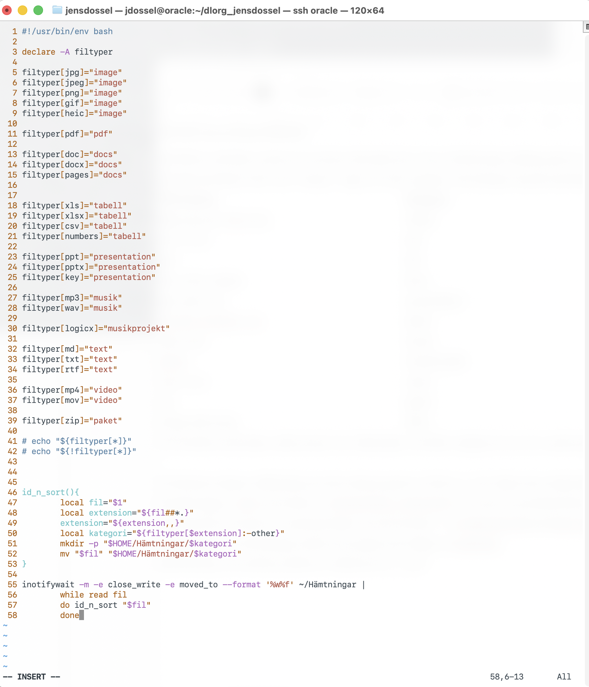

{\rtf1\ansi\ansicpg1252\cocoartf2870
\cocoatextscaling0\cocoaplatform0{\fonttbl\f0\fswiss\fcharset0 Helvetica;\f1\fswiss\fcharset0 Helvetica-Oblique;\f2\fswiss\fcharset0 Helvetica-Bold;
}
{\colortbl;\red255\green255\blue255;\red0\green0\blue0;}
{\*\expandedcolortbl;;\cssrgb\c0\c0\c0;}
\paperw11900\paperh16840\margl1440\margr1440\vieww27520\viewh18560\viewkind0
\deftab720
\pard\pardeftab720\sl368\sa213\partightenfactor0

\f0\fs32 \cf2 \expnd0\expndtw0\kerning0
DLORG Jens Dossel DBAD26\uc0\u8232 \u8232 DLORG \'e4r ett Bash-script som sorterar h\'e4mtade filer i linux H\'e4mtningar-katalog genom att anv\'e4nda funktionen id_n_sort och programmet inotifywait.\
Scriptet identifierar filer som \'94landar\'94, d\'f6ps om eller skapas i H\'e4mtningar baserat p\'e5 fil\'e4ndelse och l\'e4gger dem i f\'f6rdefinierade mappar enligt en h\'e5rdkodad lista, en 
\f1\i associativ array
\f0\i0 :\
\pard\pardeftab720\sl368\sa213\partightenfactor0

\f2\b \cf2 Fil\'e4ndelser\'a0\'a0\'a0\'a0\'a0\'a0\'a0\'a0\'a0\'a0\'a0\'a0\'a0\'a0\'a0\'a0\'a0\'a0\'a0\'a0\'a0\'a0\'a0\'a0\'a0\'a0\'a0\'a0\'a0\'a0\'a0\'a0\'a0\'a0\'a0\'a0\'a0\'a0\'a0\'a0\'a0 \'a0\'a0\'a0\'a0\'a0\'a0\'a0\'a0\'a0\'a0\'a0\'a0\'a0\'a0\'a0\'a0\'a0 	Kategori
\f0\b0 \
jpeg, jpg, gif, heic, png\'a0\'a0\'a0\'a0\'a0\'a0\'a0\'a0\'a0\'a0\'a0\'a0\'a0\'a0 \'a0\'a0\'a0\'a0\'a0\'a0\'a0\'a0\'a0\'a0\'a0\'a0\'a0\'a0\'a0\'a0\'a0 		image\'a0 \
txt, rtf, md \'a0\'a0\'a0\'a0\'a0\'a0\'a0\'a0 \'a0\'a0\'a0\'a0\'a0\'a0\'a0\'a0\'a0\'a0\'a0\'a0\'a0\'a0\'a0\'a0\'a0\'a0\'a0\'a0\'a0\'a0\'a0\'a0\'a0\'a0\'a0\'a0\'a0\'a0\'a0\'a0\'a0\'a0\'a0 \'a0\'a0\'a0\'a0\'a0\'a0\'a0\'a0\'a0\'a0\'a0\'a0\'a0\'a0\'a0\'a0\'a0 	text \
pdf\'a0\'a0\'a0\'a0\'a0\'a0\'a0\'a0\'a0\'a0\'a0\'a0\'a0\'a0\'a0\'a0\'a0\'a0\'a0\'a0\'a0\'a0\'a0\'a0\'a0\'a0\'a0\'a0\'a0\'a0\'a0\'a0\'a0\'a0\'a0\'a0\'a0\'a0\'a0\'a0\'a0\'a0\'a0\'a0\'a0\'a0\'a0\'a0\'a0\'a0\'a0\'a0\'a0\'a0\'a0\'a0			pdf\
doc, docx, pages\'a0\'a0\'a0\'a0\'a0\'a0\'a0\'a0\'a0\'a0 \'a0\'a0\'a0\'a0\'a0\'a0\'a0\'a0\'a0\'a0\'a0\'a0\'a0\'a0\'a0\'a0\'a0\'a0\'a0\'a0\'a0\'a0\'a0\'a0\'a0\'a0\'a0\'a0\'a0\'a0\'a0\'a0\'a0\'a0\'a0 	docs\
ppt, pptx, key\'a0\'a0\'a0\'a0\'a0\'a0\'a0\'a0\'a0\'a0\'a0\'a0\'a0\'a0\'a0\'a0\'a0\'a0\'a0\'a0\'a0\'a0\'a0\'a0\'a0\'a0\'a0\'a0\'a0\'a0\'a0\'a0\'a0\'a0\'a0\'a0\'a0\'a0\'a0\'a0\'a0\'a0\'a0\'a0\'a0\'a0\'a0\'a0\'a0\'a0\'a0\'a0\'a0\'a0\'a0 	presentation\
xls,xlsx,numbers, csv\'a0\'a0\'a0\'a0\'a0\'a0\'a0\'a0\'a0\'a0\'a0\'a0\'a0\'a0\'a0\'a0\'a0\'a0\'a0\'a0\'a0\'a0\'a0\'a0\'a0\'a0\'a0\'a0\'a0\'a0\'a0\'a0\'a0\'a0 		tabell\
mp3, wav\'a0\'a0\'a0\'a0\'a0\'a0\'a0\'a0\'a0\'a0\'a0\'a0\'a0\'a0\'a0\'a0\'a0\'a0\'a0\'a0\'a0\'a0\'a0\'a0\'a0\'a0\'a0\'a0\'a0\'a0\'a0\'a0\'a0\'a0\'a0\'a0\'a0\'a0\'a0\'a0\'a0\'a0\'a0\'a0\'a0\'a0\'a0\'a0\'a0\'a0\'a0\'a0\'a0\'a0\'a0\'a0\'a0\'a0\'a0\'a0\'a0\'a0\'a0\'a0 	musik\
logicx\'a0\'a0\'a0\'a0\'a0\'a0\'a0\'a0\'a0\'a0\'a0\'a0\'a0\'a0\'a0\'a0\'a0\'a0\'a0\'a0\'a0\'a0\'a0\'a0\'a0\'a0\'a0\'a0\'a0\'a0\'a0\'a0\'a0\'a0\'a0\'a0\'a0\'a0\'a0\'a0\'a0\'a0\'a0\'a0\'a0\'a0\'a0\'a0\'a0\'a0\'a0\'a0\'a0\'a0\'a0\'a0\'a0\'a0\'a0\'a0\'a0\'a0\'a0\'a0\'a0\'a0	musikprojekt\
mp4, mov\'a0\'a0\'a0\'a0\'a0\'a0\'a0\'a0\'a0\'a0\'a0\'a0\'a0\'a0\'a0\'a0\'a0\'a0\'a0\'a0\'a0\'a0\'a0\'a0\'a0\'a0\'a0\'a0\'a0\'a0\'a0\'a0\'a0\'a0\'a0\'a0\'a0\'a0\'a0\'a0\'a0\'a0\'a0\'a0\'a0\'a0\'a0\'a0\'a0\'a0\'a0\'a0\'a0\'a0\'a0\'a0\'a0\'a0\'a0\'a0\'a0\'a0\'a0 	video\
zip\'a0\'a0\'a0\'a0\'a0\'a0\'a0\'a0\'a0\'a0\'a0\'a0\'a0\'a0\'a0\'a0\'a0\'a0\'a0\'a0\'a0\'a0\'a0\'a0\'a0\'a0\'a0\'a0\'a0\'a0\'a0\'a0\'a0\'a0\'a0\'a0\'a0\'a0\'a0\'a0\'a0\'a0\'a0\'a0\'a0\'a0\'a0\'a0\'a0\'a0\'a0\'a0\'a0\'a0\'a0\'a0\'a0\'a0\'a0\'a0\'a0\'a0\'a0\'a0\'a0\'a0\'a0\'a0\'a0\'a0	paket\
\'f6vriga eller inga\'a0\'a0\'a0\'a0\'a0\'a0\'a0\'a0\'a0\'a0\'a0\'a0\'a0\'a0\'a0\'a0\'a0\'a0\'a0\'a0\'a0\'a0\'a0\'a0\'a0\'a0\'a0\'a0\'a0\'a0\'a0\'a0\'a0\'a0\'a0\'a0\'a0\'a0\'a0\'a0\'a0\'a0\'a0\'a0\'a0\'a0\'a0\'a0\'a0 	other\
Vill framtida anv\'e4ndare ut\'f6ka listan \'f6ver fil\'e4ndelser och/eller kategorier kan hen enkelt g\'f6ra det via terminalkommandot \'94vim ~/jdossel/dlorg_jensdossel/dlorg\'94.\
\'a0\
Funktionen skapar m\'e5lkatalog om den saknas genom \'94mkdir -p\'94, och d\'f6per den enligt kategorinamnet.\
Scriptet ligger i repot och foldern \'94~/jdossel/dlorg_jensdossel\'94, och har en symbolisk l\'e4nk i \'94~/.local/bin/dlorg\'94\
Det aktiveras vid start av anv\'e4ndarmilj\'f6n via service-filen \'94~/.config/systemd/user/dlorg.service\'94. \
Bevakningen av H\'e4mtningar/ sk\'f6ts via scriptet med hj\'e4lp av inotifywait.\
Identifiering och sortering sk\'f6ts av funktionen id_n_sort.\
\
\
}